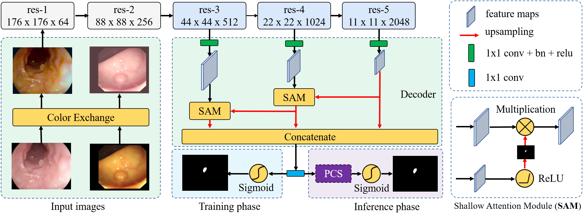
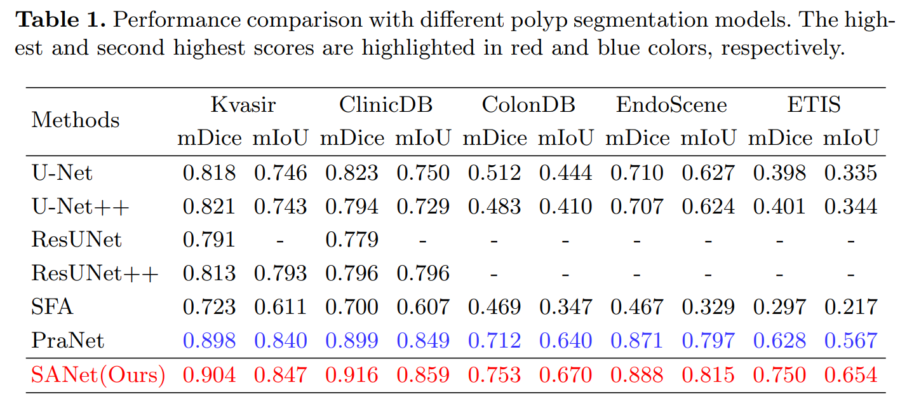
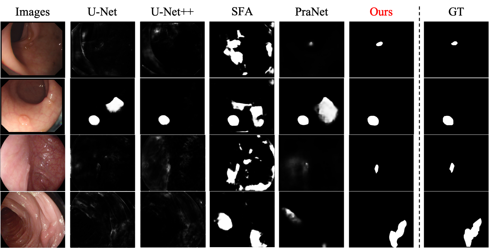

## [Shallow Attention Network for Polyp Segmentation](https://arxiv.org/pdf/2108.00882.pdf)
by Jun Wei, Yiwen Hu, Ruimao Zhang, Zhen Li, S.Kevin Zhou, Shuguang Cui

## Introduction
Accurate polyp segmentation is of great importance for colorectal cancer diagnosis. However, even with a powerful deep neural network, there still exists three big challenges that impede the development of polyp segmentation. (i) Samples collected under different conditions show inconsistent colors, causing the feature distribution gap and overfitting issue; (ii) Due to repeated feature downsampling, small polyps are easily degraded; (iii) Foreground and background pixels are imbalanced, leading to a biased training. To address the above issues, we propose the Shallow Attention Network (SANet) for polyp segmentation. Specifically, to eliminate the effects of color, we design the color exchange operation to decouple the image contents and colors, and force the model to focus more on the target shape and structure. Furthermore, to enhance the segmentation quality of small polyps, we propose the shallow attention module to filter out the background noise of shallow features. Thanks to the high resolution of shallow features, small polyps can be preserved correctly. In addition, to ease the severe pixel imbalance for small polyps, we propose a probability correction strategy (PCS) during the inference phase. Note that even though PCS is not involved in the training phase, it can still work well on a biased model and consistently improve the segmentation performance. Quantitative and qualitative experimental results on five challenging benchmarks confirm that our proposed SANet outperforms previous state-of-the-art methods by a large margin and achieves a speed about 72FPS.

## Clone repository

```shell
git clone https://github.com/weijun88/SANet.git
cd SANet/
```

## File tree
```
SANet                           
├─data                          
│  ├─test                       
│  │  ├─CVC-300                 
│  │  │  ├─image
│  │  │  └─mask
│  │  ├─CVC-ClinicDB
│  │  │  ├─image
│  │  │  └─mask
│  │  ├─CVC-ColonDB
│  │  │  ├─image
│  │  │  └─mask
│  │  ├─ETIS-LaribPolypDB
│  │  │  ├─image
│  │  │  └─mask
│  │  └─Kvasir
│  │      ├─image
│  │      └─mask
│  └─train
│      ├─image
│      └─mask
├─eval
│  └─prediction
│      └─SANet
│          ├─CVC-300
│          ├─CVC-ClinicDB
│          ├─CVC-ColonDB
│          ├─ETIS-LaribPolypDB
│          └─Kvasir
├─fig
├─res
└─src
    └─out
```

## Download dataset

The training and testing datasets come from [PraNet](https://github.com/DengPingFan/PraNet). Download these datasets and unzip them into `data` folder

- [Training Dataset](https://drive.google.com/file/d/1lODorfB33jbd-im-qrtUgWnZXxB94F55/view?usp=sharing)
- [Testing Dataset](https://drive.google.com/file/d/1o8OfBvYE6K-EpDyvzsmMPndnUMwb540R/view?usp=sharing)

## Download model

- If you want to test the performance of SANet, please download our trained model ([Baidu: km9q](https://pan.baidu.com/s/10FLaRoTsZq8ESmnS6I-TVQ) | [Google](https://drive.google.com/file/d/1x6zE73weJ6I_4Vquwe4bt0zf_gahNo0n/view?usp=sharing)) into `src/out` folder
- If you want to train your own model, please download the [pretrained model](https://drive.google.com/file/d/1_1N-cx1UpRQo7Ybsjno1PAg4KE1T9e5J/view?usp=sharing) into `res` folder

## Prerequisites

- [Python 3.7](https://www.python.org/)
- [Pytorch 1.8](http://pytorch.org/)
- [OpenCV 4.5](https://opencv.org/)
- [Numpy 1.18](https://numpy.org/)
- [Albumentations 0.5](https://github.com/albumentations-team/albumentations)
- [Apex](https://github.com/NVIDIA/apex)


## Training

```shell
    cd src/
    python3 train.py
```

## Testing

```shell
    cd src
    python3 test.py
```
- After testing, predictions of testing dataset will be saved in `eval/SANet/` folder.

## Evaluation
- To evaluate the performace of SANet, please use MATLAB to run `main.m`
```shell
    cd eval
    matlab
    main
```

## Predictions & Trained model
- trained model: [Baidu: km9q](https://pan.baidu.com/s/10FLaRoTsZq8ESmnS6I-TVQ) | [Google](https://drive.google.com/file/d/1x6zE73weJ6I_4Vquwe4bt0zf_gahNo0n/view?usp=sharing)
- predictions: [Baidu：598i](https://pan.baidu.com/s/1u6EdWxn9WHy0drEK3LBUwA) | [Google](https://drive.google.com/file/d/1hIJzzKA5aQEyLIRid5PJU9_JZZ4nGkGQ/view?usp=sharing)

- Quantitative comparisons 


- Qualitative comparisons 


## Citation
- If you find this work is helpful, please cite our paper
```
@inproceedings{SANet,
  title        = {Shallow Attention Network for Polyp Segmentation},
  author       = {Wei, Jun and Hu, Yiwen and Zhang, Ruimao and Li, Zhen and Zhou, S.Kevin and Cui, Shuguang},
  booktitle    = {International Conference on Medical Image Computing and Computer-Assisted Intervention},
  pages        = {699--708},
  year         = {2021},
  organization = {Springer}
}
```
